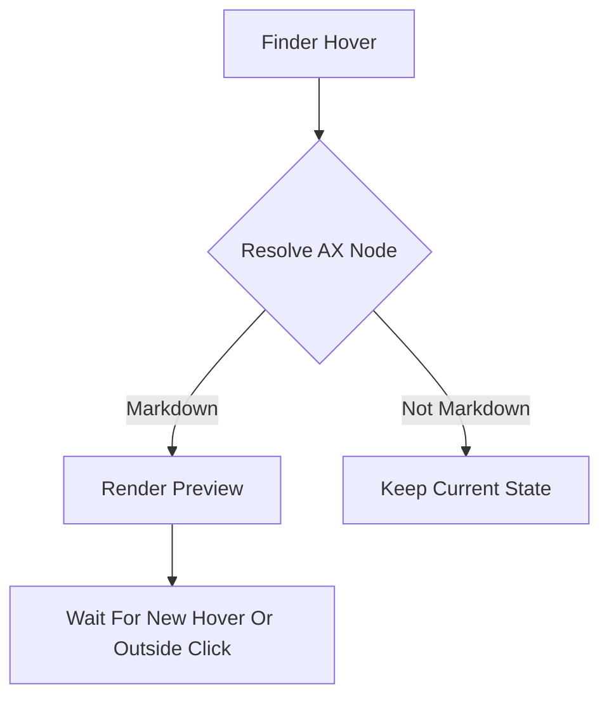
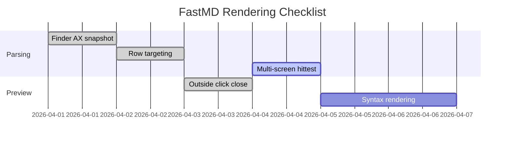
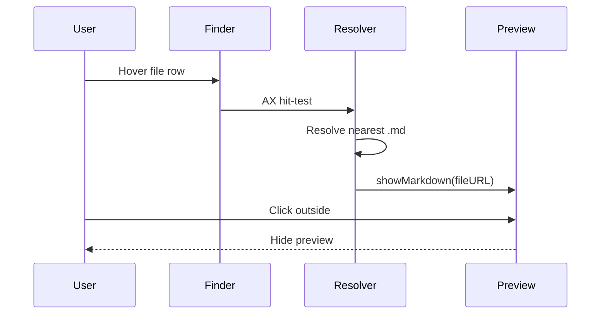

# FastMD Rich Preview Demo

这是一个专门用于预览渲染检查的 Markdown 样例文件。

---

## 1. Headings

# H1 一级标题
## H2 二级标题
### H3 三级标题
#### H4 四级标题
##### H5 五级标题
###### H6 六级标题

## 2. Paragraphs And Inline Styles

普通段落可以混合 **粗体**、*斜体*、***粗斜体***、~~删除线~~、`inline code`、<mark>高亮</mark>、<sub>下标</sub>、<sup>上标</sup>。

也可以测试链接：

- [OpenAI](https://openai.com)
- <https://github.com>
- <hello@example.com>

## 3. Quotes

> 这是一级引用。
>
> 这里继续同一个引用块。
>
> > 这是二级嵌套引用。
> >
> > - 嵌套列表项 A
> > - 嵌套列表项 B

## 4. Lists

### Unordered

- 苹果
- 香蕉
- 橘子
  - 子项 1
  - 子项 2

### Ordered

1. 第一项
2. 第二项
3. 第三项

### Task List

- [x] 已完成任务
- [ ] 待完成任务
- [ ] 继续观察 Finder hover 行为

## 5. Table

| Name | Type | Status | Notes |
| --- | --- | --- | --- |
| `basic.md` | Markdown | Ready | 基础渲染 |
| `cjk.md` | Markdown | Ready | 中英文混排 |
| `rich-preview.md` | Markdown | Testing | 扩展语法覆盖 |

## 6. Code Blocks

### Swift

```swift
import Foundation

struct PreviewCard {
    let title: String
    let lines: Int
}

func render(_ card: PreviewCard) -> String {
    "title=\\(card.title), lines=\\(card.lines)"
}

let card = PreviewCard(title: "FastMD", lines: 42)
print(render(card))
```

### JavaScript

```javascript
function sum(a, b) {
  return a + b;
}

const result = sum(3, 9);
console.log(`result=${result}`);
```

### Bash

```bash
cd fastmd
swift build
swift run
```

### JSON

```json
{
  "name": "FastMD",
  "supportsHover": true,
  "features": ["markdown", "finder", "preview"]
}
```

### Diff

```diff
- old behavior: hide on any mouse move
+ new behavior: hide on new markdown or outside click
```

## 7. Mermaid

### Flowchart



### Gantt



### Sequence Diagram



## 8. Math

行内公式：$E = mc^2$，$a^2 + b^2 = c^2$，$\int_0^1 x^2 dx = \frac{1}{3}$。

块级公式：

$$
\nabla \cdot \vec{E} = \frac{\rho}{\varepsilon_0}
$$

$$
f(x) = \sum_{n=0}^{\infty} \frac{x^n}{n!}
$$

## 9. Images


## 10. Horizontal Rule

---

## 11. Footnotes

这是一个需要脚注的句子。[^note1]

[^note1]: 这是脚注内容，用来测试扩展 Markdown 语法。

## 12. HTML Blocks

<details open>
  <summary>展开/收起测试</summary>

  <p>这里是 details/summary 内容。</p>
  <ul>
    <li>适合测试 HTML block 是否保留</li>
    <li>也可测试样式继承</li>
  </ul>
</details>

<div style="padding: 12px; border: 1px solid #d1d5db; border-radius: 8px; background: #f9fafb;">
  这是一个内嵌 HTML 容器，用于观察 raw HTML 是否被保留。
</div>

## 13. Mixed CJK And English

中文 English 日本語 한국어 mixed paragraph，看看换行、字距、inline code、标点和粗体 **是否稳定**。

## 14. Escaping

\*这行前后的星号应该被转义，不应变成斜体\*。

\# 这行的井号应该显示成普通字符，而不是标题。

## 15. Long Paragraph

这是一段稍长的连续文本，用来观察自动换行、段间距、标点挤压、中英文混排、长链接、和代码字体是否协调。FastMD 当前如果只支持部分基础语法，那么像表格、Mermaid、数学公式、脚注、HTML block、任务列表 checkbox、删除线、图片等块，可能会以纯文本形式出现；这正是这个文件存在的目的。

## 16. Final Checklist

- 多级标题
- 粗体 / 斜体 / 删除线 / 行内代码
- 引用 / 列表 / 任务列表
- 表格
- 多语言代码块
- Mermaid flowchart
- Mermaid gantt
- Mermaid sequence diagram
- 行内公式 / 块级公式
- 图片
- 脚注
- HTML block
- 中英混排
